# Woodland Heath Golf Club

Woodland Heath Golf Club, is a golf club based in norfolk. The purpose of this site is to be able to provide information to future customers and also a booking system for members to be able to book tee times online.

The targetted audience is all who have a love of golf and also family and friend time.

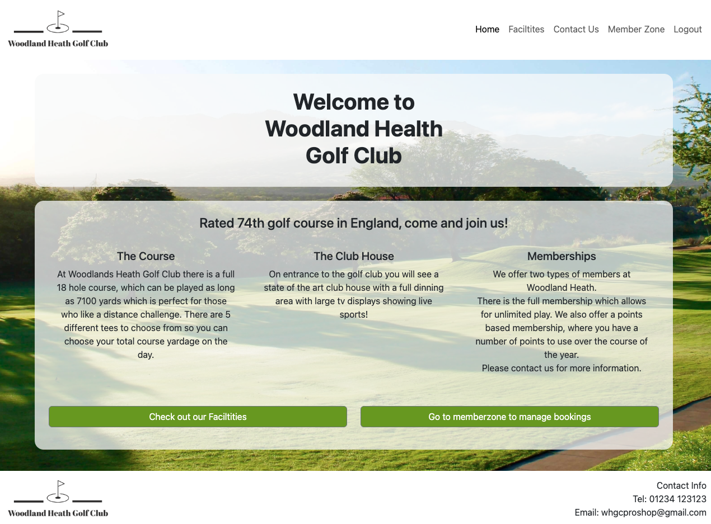

Live Site - [Woodland Health Golf Club](https://woodland-health-golf-club.herokuapp.com/)  
Project Repository - [Woodland Heath Golf Club - Repository](https://github.com/NDOMINEY/Woodland-heath-golf-club)

## Table of Contents

- [Requirements](#requirements "Requirements")
- [Design](#design "Design")
  - [Wireframes](#wireframes "Wireframes")
  - [Colour Scheme](#colour-scheme "Colour Scheme")
- [Features](#features "Features")
  - [Existing Features](#existing-features "Existing Features")
  - [Future Features](#future-features "Future Features")
- [Testing](#testing "Testing")
  - [Development Process](#development-process "Development Process")
  - [Usability Testing](#usability-testing "Usability Testing")
  - [User Requirement Testing](#user-requirement-testing "User Requirement Testing")
  - [Functional Testing](#functional-testing "Functional Testing")
  - [Validator Testing](#validator-testing "Validator Testing")
  - [Unfixed Bugs](#unfixed-bugs "Unfixed Bugs")
- [Technologies Used](#technologies-used "Technologies Used")
  - [Main Languages Used](#main-languages-used "Main Languages Used")
- [Deployment](#deployment "Deployment")
- [Credits](#credits "Credits")
  - [Content](#content "Content")
  - [Media](#media "Media")

## Requirements

Please see below a table showing the key requirements of the site and their importance.

| Requirement                                                                         | Importance | Viability/Feasibility |
| ----------------------------------------------------------------------------------- | :--------: | :-------------------: |
| Have a clear and purposeful landing page displaying the golf course                 |     5      |           5           |
| Provide the site visitor with information about the facilities available            |     5      |           5           |
| Enable the user to be able to register for a login to gain access to online booking |     5      |           5           |
| Enable a login link so user can easily login                                        |     5      |           5           |
| Enable logged in user to log out                                                    |     5      |           5           |
| Have a memberzone which provides ability to book a tee time, edit, and delete it    |     5      |           5           |
| Provide the site user a way to be able to submit an online contact form             |     4      |           5           |

## Design

### Wireframes:

- Please find link to [Full Screen Wireframe](documentation/wireframe-large-screen.pdf)
- Please find link to [Mobile Screen Wireframe](documentation/wireframes-mobile.pdf)

### Colour Scheme:

A neutral colour scheme was selected with a green accent colour to compliment the golf course image back ground.

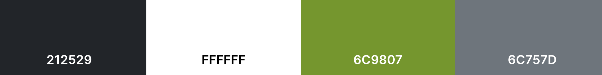

## Features

### Existing Features

#### Navigation Bar

The navigation bar is a fixed element of the top of the page and is uniform accross all areas of the site. It have the company logo and clear links to explore different areas of the site. When the user is not logged in, the nav bar shows links to 'login' and 'register'. Once logged in, this changes to 'memberzone' and 'log out'

##### Navigation bar - user not logged in

##### Navigation bar - user logged in

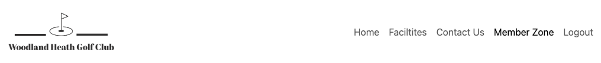

The navigation also changed to a hamburger menu when the screen size is smaller for viewability and usability.

##### Navigation bar - hamburger view

##### Navigation bar - collapsed hamburger view

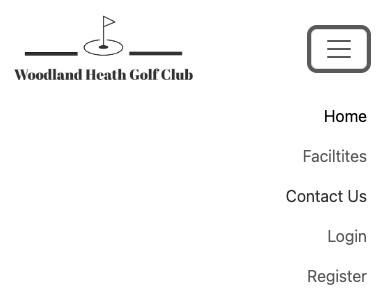

#### Footer

In addition to the navigation bar, on the bottom on every page is a footer. This shows the golf club logo and basic contact information for easy access for the site user.

#### Home Page/Landing Page

When you first access the site, you are directed to the home page. This has a bold welcome statement so the user can verify the site they have visited quickly.

There is a summary of the course, club house and membership for quick information. For a user that is not logged in, it presents them with the following buttons which sign posts them to key areas of the site.

- 'Check out our facilities'
- 'Register to make a booking'
- 'Login in you already have an account'

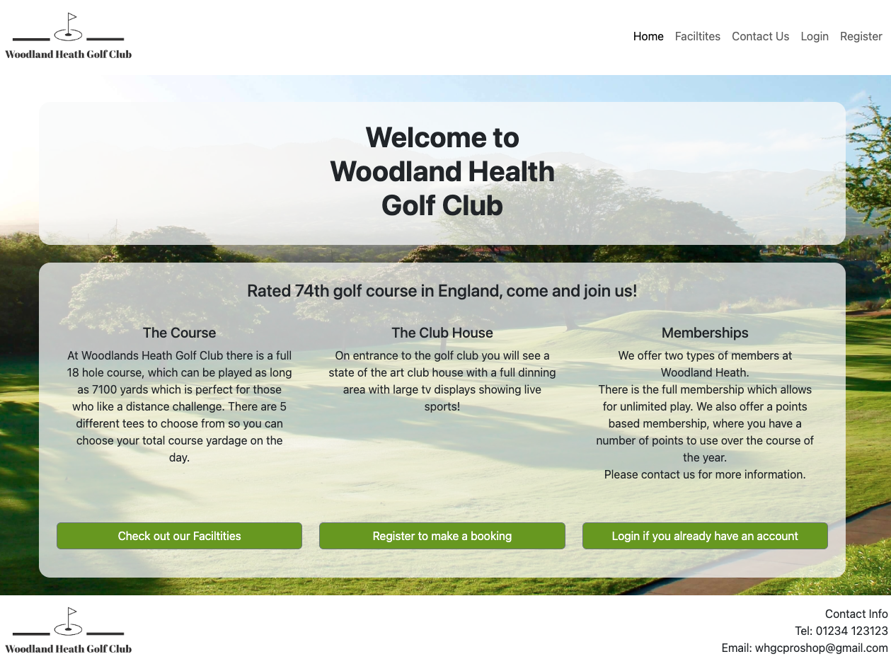

#### About - Facilities

The facilities page presents the site user with an overview of facilities available at the golf course. This is shown with relevant images to show case them with overlaying banners in the accent green colour enhance them and make them eye catching.

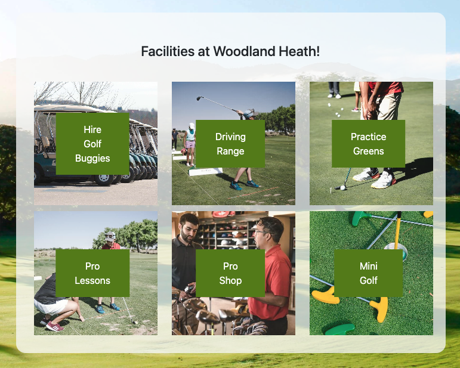

#### Contact Us

The 'Contact Us' page give the user basic location and contact information, with an embeded google maps.
Additionally, for ease of submitting an enquiry the user is able to complete a contact form. This form will then send an email to the whgcproshop@gmail.com account and send an automatic reply to the user to confirm receipt.

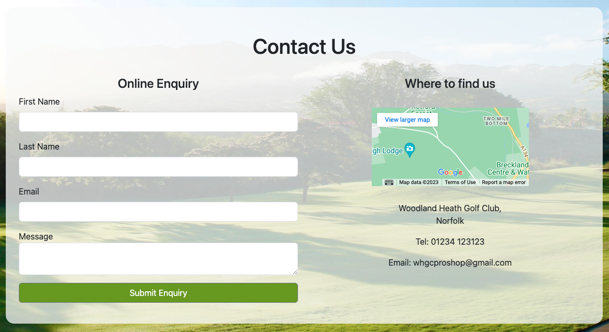

If the user is logged in, this online enquiry form will auto populate their basic details for ease of use.

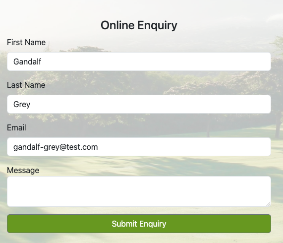

#### User Registration

Within the navigation bar, there is a link to register for a new account. This takes the user to a registration page to complete.

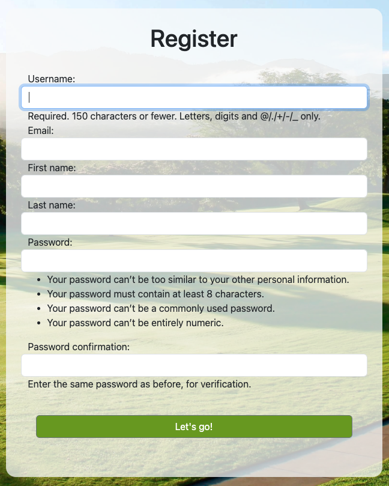

Once completed, the user is redirected back to the home page and a success alert is displayed.

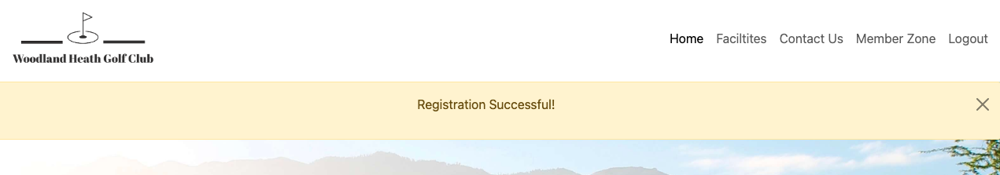

#### User Login

Within the navigation bar, there is a link to login for users who already have an account. This takes the user to a login page. Upon sucessful login, the user is directed to the home page.

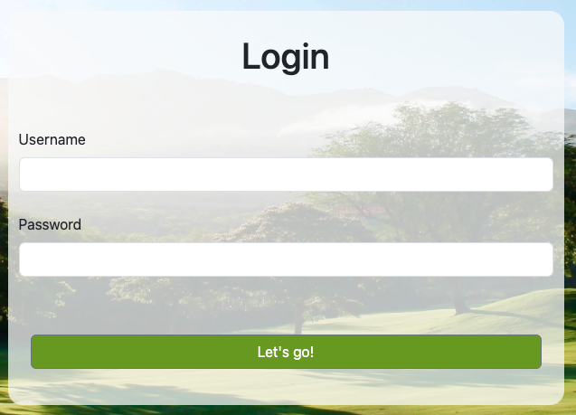

#### User Logout

Within the navigation bar, there is a link to logout for users who have already logged in. This logs the user out, returning them to the home page with a success alert displayed.

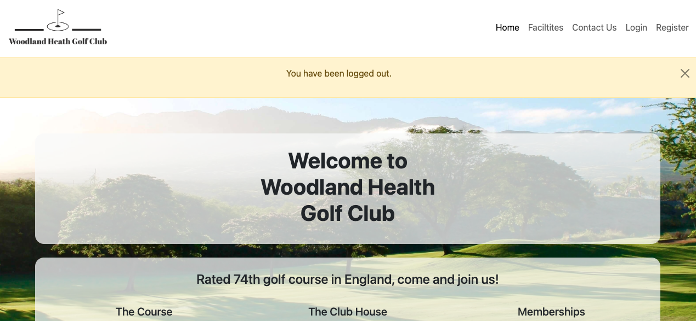

#### Memberzone

When a user has sucessfully logged in, they are able to click into the memberzone from the navigation bar. From here they are greated with a welcome message including their name.
From this page they are able to select to create a new booking or view and edit existing ones.

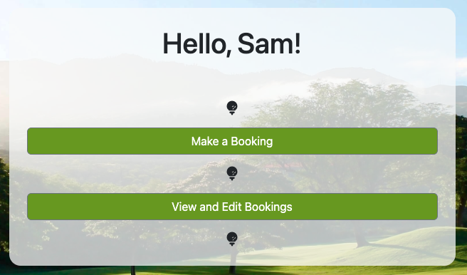

#### Booking a Tee Time

##### First step - select date

Booking a tee time is completed in two steps. In the first instance, the site user is directed to the page to select a date they wish to book from. The date will default to the next calendar day.

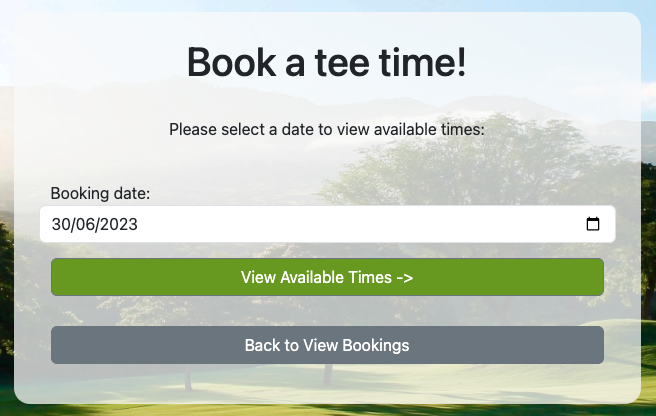

To prevent the user from selecting a date prior to this, an error message will be displayed and the button to progress the booking is no longer visible.

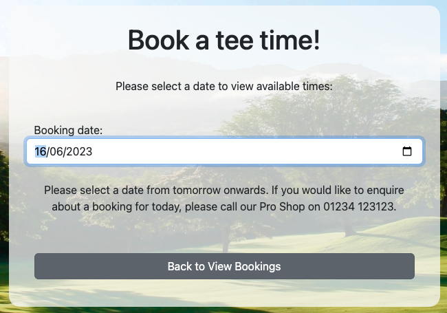

##### Second step - select time and number of players

After the date is selected, the user can then view available times for that day. They will need to select their time, and the number of players for the booking to then submit it.

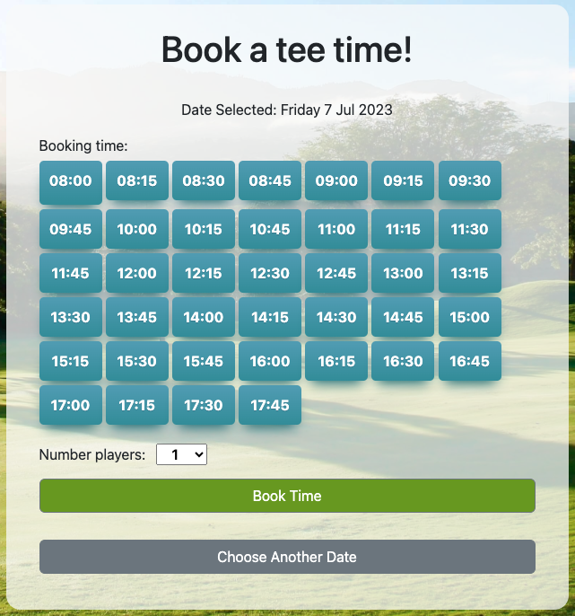

Once the booking is complete, the user will be redirected back to the memberzone page and an alert will appear confirming the booking.

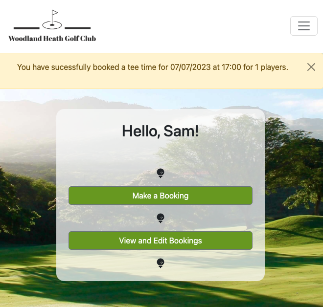

#### View, Edit, and Cancel Bookings

#### View Bookings

Within the memberzone, the user is able to select to view and edit bookings. This directs the user to a page listing their current bookings. If there are no bookings present it will display a message to let them know that this is the case.

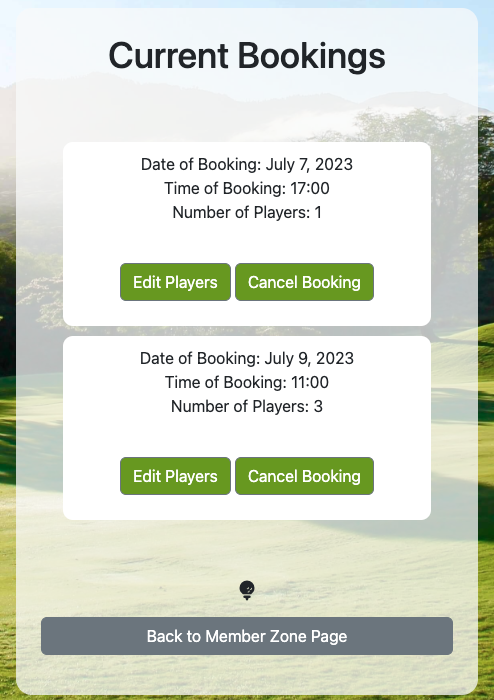

#### Edit Players in Bookings

Each booking displayed has a button to enable to the user to edit the number of players for their booking. This redirects the user to an edit page which displays the selected booking and a drop down to change the total number of players.

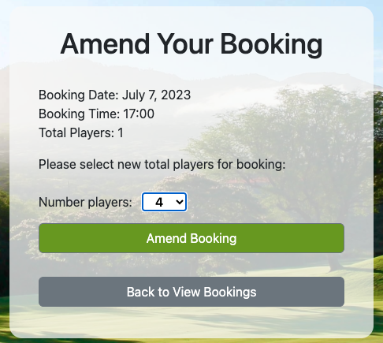

#### Cancel Bookings

Each booking also has a cancel button. Upon clicking this a modal pops up for the user to confirm that they want to cancel that particular booking.

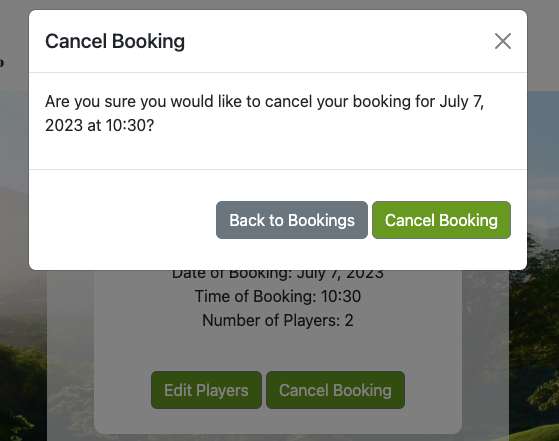

If the user continues to cancel the booking, they are returned to the view bookings page and an alert is displayed to confirm this has been completed.

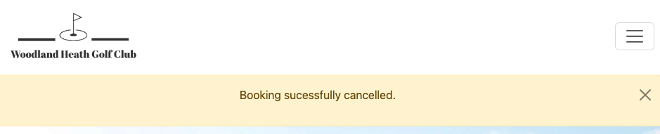

### Future Features

## Testing

### Development Process

### Usability Testing

### User Requirement Testing

### Functional Testing

### Validator Testing

### Unfixed Bugs

## Technologies Used

- Whitenoise was used to serve the static files - [Whitenoise](https://whitenoise.readthedocs.io/en/stable/)
- Bootstrap was used for basic html styling - [Bootstrap](https://getbootstrap.com/)
- jQuery was used for dom manipulation in the script files - [jQuery](https://jquery.com/)
- Elephantsql was used for the sites database - [ElephantSQL](https://customer.elephantsql.com/)
- EmailJS was used to send online requests to the proshop and an autoreply to the site user - [EmailJS](https://www.emailjs.com/)

### Main Languages Used

- Python
- Javascript
- HTML5
- CSS3

## Deployment

#### Future development

To carry out further development on the project you can clone the repository locally. This is completed by carrying out the following steps -

Within your repository, make sure you are on the 'Code' tab
Click on the button that shows '<> Code'
Then select how you wish to clone
To create an isolated version of the project, you may add a branch off of main. To do this follow the below steps -

Whilst in the code section, click on 'branch'
You will then see a breakdown of the exisiting branches
To add a new branch, click 'New Branch' which is a green button
Then name your branch and select the branch source

## Credits

### Content

#### EmailJS

Set up for EmailJS was aided by the CodeInstitue tutorials and the EmaiJS suppoting documentation.

#### Django login and registration

Django tutorial videos from Codemy on youtube to help implement the register, login and logout functionality - [Codemy](https://www.youtube.com/@Codemycom/search?query=django%20user)

#### Image compression

The following online tool was used to compress the size of images for the site - [tinypng & tinyjpeg](https://tinypng.com/)

### Media

#### Images

The following images were sourced from [Pexels](https://www.pexels.com/)

- [Background golf course](https://www.pexels.com/photo/green-leaf-trees-on-grass-field-914682/)
- [Features - Mini Golf](https://www.pexels.com/photo/green-and-yellow-putters-on-green-grass-6370068/)
- [Features - Golf Tuition](https://www.pexels.com/photo/boy-holding-golf-club-in-front-of-crouching-woman-1325655/)
- [Features - Pro Shop](https://www.pexels.com/photo/man-standing-beside-man-holding-gray-club-1325735/)
- [Features - Putting Area](https://www.pexels.com/photo/person-playing-golf-1325661/)
- [Features - Golf Buggy](https://www.pexels.com/photo/bag-bus-car-cart-274108/)
- [Features - Practice Range](https://www.pexels.com/photo/person-swinging-golf-club-on-field-1325659/)

#### Logo

The logo was created using [Adobe Express](https://www.adobe.com/express/create/logo/website)

#### Favicon

The following generator was used for the sites favicon - [favicon.io](https://favicon.io/favicon-converter/)

#### Icons

The following was used for icons on the site - [font awesone](https://fontawesome.com/icons/golf-ball-tee?f=classic&s=solid&pc=%23ffffff)
