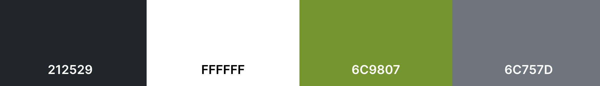
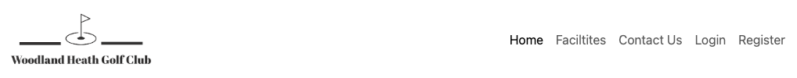

# Woodland Heath Golf Club

Woodland Heath Golf Club, is a golf club based in norfolk. The purpose of this site is to be able to provide information to future customers and also a booking system for members to be able to book tee times online.

The targetted audience is all who have a love of golf and also family and friend time.

Live Site - [Woodland Health Golf Club](https://woodland-health-golf-club.herokuapp.com/)  
Project Repository - [Woodland Heath Golf Club - Repository](https://github.com/NDOMINEY/Woodland-heath-golf-club)

## Table of Contents

- [Requirements](#requirements "Requirements")
- [Design](#design "Design")
  - [Wireframes](#wireframes "Wireframes")
  - [Colour Scheme](#colour-scheme "Colour Scheme")
- [Features](#features "Features")
  - [Existing Features](#existing-features "Existing Features")
  - [Future Features](#future-features "Future Features")
- [Testing](#testing "Testing")
  - [Development Process](#development-process "Development Process")
  - [Usability Testing](#usability-testing "Usability Testing")
  - [User Requirement Testing](#user-requirement-testing "User Requirement Testing")
  - [Functional Testing](#functional-testing "Functional Testing")
  - [Validator Testing](#validator-testing "Validator Testing")
- [Technologies Used](#technologies-used "Technologies Used")
  - [Main Languages Used](#main-languages-used "Main Languages Used")
- [Deployment](#deployment "Deployment")
- [Credits](#credits "Credits")
  - [Content](#content "Content")
  - [Media](#media "Media")

## Requirements

Please see below a table showing the key requirements of the site and their importance.

| Requirement                                                                         | Importance | Viability/Feasibility |
| ----------------------------------------------------------------------------------- | :--------: | :-------------------: |
| Have a clear and purposeful landing page displaying the golf course                 |     5      |           5           |
| Provide the site visitor with information about the facilities available            |     5      |           5           |
| Enable the user to be able to register for a login to gain access to online booking |     5      |           5           |
| Enable a login link so user can easily login                                        |     5      |           5           |
| Enable logged in user to log out                                                    |     5      |           5           |
| Have a memberzone which provides ability to book a tee time, edit, and delete it    |     5      |           5           |
| Provide the site user a way to be able to submit an online contact form             |     4      |           5           |

## Design

### Wireframes:

- Please find link to [Full Screen Wireframe](documentation/wireframe-large-screen.pdf)
- Please find link to [Mobile Screen Wireframe](documentation/wireframes-mobile.pdf)

### Colour Scheme:

A neutral colour scheme was selected with a green accent colour to compliment the golf course image back ground.

## Features

### Existing Features

#### Navigation Bar

The navigation bar is a fixed element of the top of the page and is uniform accross all areas of the site. It have the company logo and clear links to explore different areas of the site. When the user is not logged in, the nav bar shows links to 'login' and 'register'. Once logged in, this changes to 'memberzone' and 'log out'

##### Navigation bar - user not logged in

##### Navigation bar - user logged in

The navigation also changed to a hamburger menu when the screen size is smaller for viewability and usability.

##### Navigation bar - hamburger view

##### Navigation bar - collapsed hamburger view

#### Footer

In addition to the navigation bar, on the bottom on every page is a footer. This shows the golf club logo and basic contact information for easy access for the site user.

#### Home Page/Landing Page

When you first access the site, you are directed to the home page. This has a bold welcome statement so the user can verify the site they have visited quickly.

There is a summary of the course, club house and membership for quick information. For a user that is not logged in, it presents them with the following buttons which sign posts them to key areas of the site.

- 'Check out our facilities'
- 'Register to make a booking'
- 'Login in you already have an account'

#### About - Facilities

The facilities page presents the site user with an overview of facilities available at the golf course. This is shown with relevant images to show case them with overlaying banners in the accent green colour enhance them and make them eye catching.

#### Contact Us

The 'Contact Us' page give the user basic location and contact information, with an embeded google maps.
Additionally, for ease of submitting an enquiry the user is able to complete a contact form. This form will then send an email to the whgcproshop@gmail.com account and send an automatic reply to the user to confirm receipt.

If the user is logged in, this online enquiry form will auto populate their basic details for ease of use.

#### User Registration

Within the navigation bar, there is a link to register for a new account. This takes the user to a registration page to complete.

Once completed, the user is redirected back to the home page and a success alert is displayed.

#### User Login

Within the navigation bar, there is a link to login for users who already have an account. This takes the user to a login page. Upon sucessful login, the user is directed to the home page.

#### User Logout

Within the navigation bar, there is a link to logout for users who have already logged in. This logs the user out, returning them to the home page with a success alert displayed.

#### Memberzone

When a user has sucessfully logged in, they are able to click into the memberzone from the navigation bar. From here they are greated with a welcome message including their name.
From this page they are able to select to create a new booking or view and edit existing ones.

#### Booking a Tee Time

##### First step - select date

Booking a tee time is completed in two steps. In the first instance, the site user is directed to the page to select a date they wish to book from. The date will default to the next calendar day.

To prevent the user from selecting a date prior to this, an error message will be displayed and the button to progress the booking is no longer visible.

##### Second step - select time and number of players

After the date is selected, the user can then view available times for that day. They will need to select their time, and the number of players for the booking to then submit it.

Once the booking is complete, the user will be redirected back to the memberzone page and an alert will appear confirming the booking.

#### View, Edit, and Cancel Bookings

#### View Bookings

Within the memberzone, the user is able to select to view and edit bookings. This directs the user to a page listing their current bookings. If there are no bookings present it will display a message to let them know that this is the case.

#### Edit Players in Bookings

Each booking displayed has a button to enable to the user to edit the number of players for their booking. This redirects the user to an edit page which displays the selected booking and a drop down to change the total number of players.

#### Cancel Bookings

Each booking also has a cancel button. Upon clicking this a modal pops up for the user to confirm that they want to cancel that particular booking.

If the user continues to cancel the booking, they are returned to the view bookings page and an alert is displayed to confirm this has been completed.

### Future Features

## Testing

### Development Process

Throughout the development process, each feature added was manually tested locally to ensure it worked as intended. Once I was happy with the result whilst in localhost, I would then add, commit and push to GitHub. This resulted in realtime changes and adjustments before committing the new code through to main.
 
This particularly enabled me to highlight styling issues where I predominantly used bootstrap and then customised accordingly in a separate style.css. For instance, on one circumstance through the debugging process I found that bootstrap had used !important. Although not best practice, I had to use this in my own css to be able to override it.

### Usability Testing

All text throughout the site has been styled to be clear and easy to ready. Although the background is an image through out the website, I used a translucent layer between this and text to ensure it was still readable.
 
Within my colour scheme, I also ensure I had an accent colour which I was able to use to direct the user to the next steps.

### User Requirement Testing

To ensure that the website meets the expectation of user, please see below user cases which summarise whether they pass and also which tests relate to them.

|  User Case |  Description                                                                               |  Relevant test cases                                                                                    |  Result |
| ------------- | --------------------------------------------------------------------------------------------- | ---------------------------------------------------------------------------------------------------------- | ---------- |
|  UC-001    |  As a user I want to be presented with a clear landing page with basic contact information |  TC-001, TC-002                                                                                         |  Pass   |
|  UC-002    |  As a user I want to be able to see want services are available at the golf course         |  TC-003, TC-009                                                                                         |  Pass   |
|  UC-003    |  As a user I want to be able to submit an online enquiry                                   |  TC-010, TC-011, TC-012, TC-013                                                                         |  Pass   |
|  UC-004    |  As a user I want to be able to create an account                                          |  TC-007, TC-016, TC-017                                                                                 |  Pass   |
|  UC-005    |  As a user I want to be able to view available booking                                     |  TC-005, TC-008, TC-014, TC-015, TC-022                                                                 |  Pass   |
|  UC-006    |  As a user I want to be able to create a booking                                           |  TC-005, TC-008, TC-014, TC-015, TC-022, TC-023, TC-024, TC-025, TC-026, TC-027, TC-028, TC-029, TC-030 |  Pass   |
|  UC-007    |  As a user I want to be able to view my bookings                                           |  TC-005, TC-008, TC-014, TC-015, TC-022, TC-031, TC-032                                                 |  Pass   |
|  UC-008    |  As a user I want to be able to edit the total number of player in bookings                |  TC-005, TC-008, TC-014, TC-015, TC-022, TC-033, TC-034, TC-035, TC-036, TC-037                         |  Pass   |
|  UC-009    |  As a user I want to be able to delete my bookings                                         |  TC-005, TC-008, TC-014, TC-015, TC-022, TC-033, TC-038, TC-039, TC-040, TC-041                         |  Pass   |
|  UC-010    |  As a user I want to be able to logout to keep my information private                      |  TC-042                                                                                                 |  Pass   |
|  UC-011    |  As a user I want to be able to navigate through the whole site from each page             |  TC-018, TC-019, TC-020                                                                                 |  Pass   |

### Functional Testing

Upon deployment through heroku, a total of 42 functional tests were carried out to ensure the website functioned correctly.

Please expand 'Functional Test Cases' below to see a breakdown of the tests carried out.

Functional Test Cases

|   Test Case  |   Description                                                                                                                                                                                                           |   Pre Conditions                                                                   |   Steps to Executed                                                                                                                                                                                          |   Result  |   Comments  |
|-----------------|----------------------------------------------------------------------------------------------------------------------------------------------------------------------------------------------------------------------------|---------------------------------------------------------------------------------------|-----------------------------------------------------------------------------------------------------------------------------------------------------------------------------------------------------------------|--------------|----------------|
|   TC-001     |   Website Landing Page - Upon loading the site the user is greeted with a home page                                                                                                                                     |   N/A                                                                              |   1. Open game in browser       2. Enter website URL       3. Check home page is loaded                                                                                        |   Pass    |             |
|   TC-002     |   Website Landing Page - The home page demonstrates that the site is for Woodland Heath golf club and basic contact information is present                                                                              |   Home page loaded                                                                 |   1. Golf Club name and info is displayed       2. Check that the footer contains basic contact information                                                                                   |   Pass    |             |
|   TC-003     |   Website Landing Page - The home page button to view golf club facilities redirects user to facilities page                                                                                                            |   Home page loaded                                                                 |   1. Click Check out our Facilities button       2. Check user is directed to facilities page                                                                                                 |   Pass    |             |
|   TC-004     |   Website Landing Page - If user is logged in, two buttons are displayed in main content. These are Check out our Facilities and Go to member zone to manage bookings                                                   |   User logged in, home page loaded                                                 |   1. In the main content, check that two buttons are present for Check out our Facilities and Go to member zone to manage bookings                                                                     |   Pass    |             |
|   TC-005     |   Website Landing Page - The home page button for Go to member zone to manage bookings   Redirects user to member zone page                                                                                       |   User logged in, home page loaded                                                 |   1. Click button for Go to member zone to manage bookings       2. Check user is redirected to member zone page                                                                              |   Pass    |             |
|   TC-006     |   Website Landing Page - If user is not logged in, three buttons are displayed in main content. These are Check out our Facilities, Register to make a booking, and Login if you already have an account                |   User is not logged in, home page loaded                                          |   1. In the main content, check that two buttons are present for Check out our Facilities, Register to make a booking, and Login if you already have an account                                              |   Pass    |             |
|   TC-007     |   Website Landing Page - Home page Register to make a booking button redirects user to register page                                                                                                                    |   User is not logged in, home page loaded                                          |   1. Click button for Register to make a booking       2. Check user is redirected to register page                                                                                           |   Pass    |             |
|   TC-008     |   Website Landing Page - Home page Login if you already have an account button redirects user to login page                                                                                                             |   User is not logged in, home page loaded                                          |   1. Click button for Login if you already have an account       2. Check user is redirected to login page                                                                                    |   Pass    |             |
|   TC-009     |   Facilities - Facilities page displays available services from golf club                                                                                                                                               |   Facilities page is loaded                                                        |   1. Check facilities details are displayed to the user                                                                                                                                                      |   Pass    |             |
|   TC-010     |   Contact Us - Contact page loaded with online enquiry form with no pre-populated date                                                                                                                                  |   User is not logged in, contact us page loaded                                    |   1. Check contact form is present with no pre-populated data                                                                                                                                                |   Pass    |             |
|   TC-011     |   Contact Us - Contact page loaded with online enquiry form withpre-populated date                                                                                                                                      |   User is logged in, contact us page loaded                                        |   1. Check contact form is present with pre-populated data from the user account                                                                                                                             |   Pass    |             |
|   TC-012     |   Contact Us - When contact form is submitted an email is sent to the pro shop                                                                                                                                          |   Contact form has been submitted                                                  |   1. On form submission an email with the details is received at the pro shop email                                                                                                                          |   Pass    |             |
|   TC-013     |   Contact Us - When contact form is submitted an email is sent to user to confirm receipt                                                                                                                               |   Contact form has been submitted                                                  |   1. On form submission an email is sent to the user to confirm receipt                                                                                                                                      |   Pass    |             |
|   TC-014     |   Login - If incorrect login details are entered an error is displayed to the user                                                                                                                                      |   Login page is loaded                                                             |   1. Fill in login form with incorrect details       2. Submit form        3. Check error is displayed to user                                                                 |   Pass    |             |
|   TC-015     |   Login - If correct login details are entered and user is redirected to home page                                                                                                                                      |   Login page is loaded                                                             |   1. Fill in login form with correct details       2. Submit form        3. Check user is redirected to home page                                                              |   Pass    |             |
|   TC-016     |   Registration - On the registration page, the form displays errors when incorrect details are loaded                                                                                                                   |   Register page is loaded                                                          |   1. Fill in register form with incorrect details       2. Submit form        3. Check error is displayed to user                                                              |   Pass    |             |
|   TC-017     |   Registration - On the registration page, when correct information is submitted the user is redirected to home page                                                                                                    |   Register page is loaded                                                          |   1. Fill in register form with correct details       2. Submit form        3. Check user is redirected to home page                                                           |   Pass    |             |
|   TC-018     |   Navigation - Navigation bar is displayed at the top of each page                                                                                                                                                      |                                                                                    |   1. Cycle through each available page and check that navigation bar is present                                                                                                                              |   Pass    |             |
|   TC-019     |   Navigation - when the user is logged out, the following links are available - Home, Facilities, Contact Us, Login, Register                                                                                           |   User is logged out                                                               |   1. Check that the following links are available - Home, Facilities, Contact Us, Login, Register                                                                                                            |   Pass    |             |
|   TC-020     |   Navigation - when the user is logged out, the following links are available - Home, Facilities, Contact Us, Memberzone, Logout                                                                                        |   User is logged in                                                                |   1. Check that the following links are available - Home, Facilities, Contact Us, Memberzone, Logout                                                                                                         |   Pass    |             |
|   TC-021     |   Memberzone - Page greets user by name                                                                                                                                                                                 |   User is logged in and member zone page loaded                                    |   1. Check greeting displays user first name                                                                                                                                                                 |   Pass    |             |
|   TC-022     |   Memberzone - the following action buttons are available to the user - Make a Booking and View and Edit Bookings.                                                                                                      |   User is logged in and member zone page loaded                                    |   1. Check the following buttons are present - Make a Booking and View and Edit Bookings.                                                                                                                    |   Pass    |             |
|   TC-023     |   Memberzone - when the Make a Booking  button is clicked the user is redirected to the booking page                                                                                                                    |   User is logged in and member zone page loaded                                    |   1. Click button for Make a Booking     2. Check user is redirected to booking page                                                                                                                   |   Pass    |             |
|   TC-024     |   Booking - on select booking date page user is alerted of an error when the select a date with the value of today or prior                                                                                             |   User is logged in and first booking page is loaded                               |   1. Select a date before today       2. Check date error is displayed to user                                                                                                                |   Pass    |             |
|   TC-025     |   Booking - on select booking date page View Available Times button is not displayed when user selects a date with the value of today or prior                                                                          |   User is logged in and first booking page is loaded                               |   1. Select a date before today       2. Check View Available Times button is no longer visable                                                                                               |   Pass    |             |
|   TC-026     |   Booking - on select booking date page when a future date is selected, the user can click View Available Times button                                                                                                  |   User is logged in and first booking page is loaded                               |   1. Select a future date       2. Check View Available Times button is available                                                                                                             |   Pass    |             |
|   TC-027     |   Booking - when the user clicks View Available Times button they are directed to the next booking page                                                                                                                 |   User is logged in and first booking page is loaded and a future date is picked   |   1. Click View Available Times       2. Check user is redirected to second stage of booking                                                                                                  |   Pass    |             |
|   TC-028     |   Booking - when the second stage of booking page is loaded, the user is able to view available time slots                                                                                                              |   User is logged in and progressed to second page of booking                       |   1. Check available times are showing                                                                                                                                                                       |   Pass    |             |
|   TC-029     |   Booking - when the user has selected a time and the total number of played they are able to click Book Time                                                                                                           |   User is logged in and progressed to second page of booking                       |   1. Select a time for booking and total number of players       2. Check user is able to click Book Time                                                                                     |   Pass    |             |
|   TC-030     |   Booking - when the user clicks Book Time they are redirected to the member zone page and a success alert is displayed                                                                                                 |   User is logged in and submitted booking details                                  |   1. Submit booking via Book Time button       2. Check user redirected to member zone page and success alert is displayed.                                                                   |   Pass    |             |
|   TC-031     |   Memberzone - when the View and Edit Bookings  button is clicked the user is redirected to the view bookings page                                                                                                      |   User is logged in and member zone page loaded                                    |   1. Click button for View and Edit Bookings     2. Check user is redirected to view bookings page                                                                                                     |   Pass    |             |
|   TC-032     |   View, Edit and Cancel Bookings - All current bookings under that user is displayed                                                                                                                                    |   User is logged in and view bookings page loaded                                  |   1. Check all relevant bookings are displayed                                                                                                                                                               |   Pass    |             |
|   TC-033     |   View, Edit and Cancel Bookings - Each booking displays two buttons Edit Players and Cancel Booking                                                                                                                    |   User is logged in and view bookings page loaded                                  |   1. Check the following buttons are displayed for each booking - Edit Players and Cancel Booking                                                                                                            |   Pass    |             |
|   TC-034     |   View, Edit and Cancel Bookings - when user click Edit Players they are redirected to the edit booking page                                                                                                            |   User is logged in and view bookings page loaded                                  |   1. Click the Edit Players button on a booking       2. Check user redirected to edit booking page                                                                                           |   Pass    |             |
|   TC-035     |   View, Edit and Cancel Bookings - when the edit booking page is loaded check that the correct booking details is loaded on the page                                                                                    |   User is logged in and edit bookings page loaded                                  |   1. Check that the correct data is displayed through to the edit booking page                                                                                                                               |   Pass    |             |
|   TC-036     |   View, Edit and Cancel Bookings - user is able to change the total number of players and click Amend Booking                                                                                                           |   User is logged in and edit bookings page loaded                                  |   1. Change total number of players for booking via the drop down       2. Check user is able to click Amend Booking button                                                                   |   Pass    |             |
|   TC-037     |   View, Edit and Cancel Bookings - when Amend Booking button is clicked user is redirected to the view bookings page and the record is updated                                                                          |   User is logged in and user has submitted a change to the booking                 |   1. Click Amend Booking       2. Check user is redirected back to the view bookings page and the updated information is reflected in the booking                                             |   Pass    |             |
|   TC-038     |   View, Edit and Cancel Bookings - when user click Cancel Booking a pop up appears to ask the user to confirm if they want to proceed                                                                                   |   User is logged in and view bookings page loaded                                  |   1. Click the Cancel Booking button on a booking       2. Check a pop up appears to confirm whether the user wishes to continue                                                              |   Pass    |             |
|   TC-039     |   View, Edit and Cancel Bookings - when the cancel booking pop up appears the following buttons are displayed - Back to Bookings and Cancel Booking                                                                     |   User is logged in and cancel booking button has been clicked                     |   1. Check pop up contains the following two buttons - Back to Bookings and Cancel Booking                                                                                                                   |   Pass    |             |
|   TC-040     |   View, Edit and Cancel Bookings - when the cancel booking pop up appears and the Back to Booking is clicked the user is redirected back to the view bookings page                                                      |   User is logged in and cancel booking button has been clicked                     |   1. Click the Back to Booking button       2. Check user is redirected back to view bookings page                                                                                            |   Pass    |             |
|   TC-041     |   View, Edit and Cancel Bookings - when the cancel booking pop up appears and the Cancel Booking button is clicked the user is redirected back to the view bookings page and confirmation of cancellation is displayed  |   User is logged in and cancel booking button has been clicked                     |   1. Click Cancel Booking Button       2. Check user is redirected back to view bookings page        3. Check alert is displayed to user to confirm the booking was cancelled  |   Pass    |             |
|   TC-042     |   Logout - When the logout button is clicked in the navigation bar, the user is redirected to the home page and a success alert is displayed                                                                            |   User is logged in                                                                |   1. Click Logout link in navigation bar       2. Check user is redirected back to home page        3. Check alert is displayed to user to confirm they have been logged out   |   Pass    |             |

 

### Validator Testing

#### Lighthouse

Lighthouse tests were carried out accross the site to ensure performance and accessibility scored highly.

- [Home](documentation/home-lighthouse.pdf)
- [Facilities](documentation/facilities-lighthouse.pdf)
- [Contact Us](documentation/contact-lighthouse.pdf)
- [Booking - Date](documentation/booking-lighthouse.pdf)
- [Booking - Time](documentation/bookingtime-lighthouse.pdf)
- [View Bookings](documentation/viewbookings-lighthouse.pdf)

#### HTML Validator

HTML validator tests were carried out accross the site.

#### Python

Through the IDE pep8 compliance was checked to ensure the code was validated

# Technologies Used

- Whitenoise was used to serve the static files - [Whitenoise](https://whitenoise.readthedocs.io/en/stable/)
- Bootstrap was used for basic html styling - [Bootstrap](https://getbootstrap.com/)
- jQuery was used for dom manipulation in the script files - [jQuery](https://jquery.com/)
- Elephantsql was used for the sites database - [ElephantSQL](https://customer.elephantsql.com/)
- EmailJS was used to send online requests to the proshop and an autoreply to
  the site user - [EmailJS](https://www.emailjs.com/)

### Main Languages Used

- Python
- Javascript
- HTML5
- CSS3

## Deployment

This site is deployed through Heruko. The following steps where followed within Heroku -

Whilst on the main dashboard, click 'Create new app'
Then enter the name of the project, select your region, and the click 'Create App'
Within the settings tab, you must update the 'Config Vars' to include the following: DATABASE_URL, DEBUG, HEROKU_POSTGRESQL_PURPLE_URL, SECRET_KEY.
Click 'Reveal Config Vars' to add.
In the deploy tab, under deployment method select 'GitHub'
Next search and connect to the correct repository from GitHub
Finally, scroll down towards the bottom and you will see 'Manual Deployment'. Select the branch you would like to deploy from and click 'Deploy Branch'. Once complete, you will be presented with a link to open the deployed site.
You can also set up auto deployments, this means Heroku will re-deploy the site every time you push an update to your GitHub repository.

#### Future development

To carry out further development on the project you can clone the repository locally. This is completed by carrying out the following steps -

Within your repository, make sure you are on the 'Code' tab
Click on the button that shows '<> Code'
Then select how you wish to clone
To create an isolated version of the project, you may add a branch off of main. To do this follow the below steps -

Whilst in the code section, click on 'branch'
You will then see a breakdown of the exisiting branches
To add a new branch, click 'New Branch' which is a green button
Then name your branch and select the branch source

## Credits

### Content

#### EmailJS

Set up for EmailJS was aided by the CodeInstitue tutorials and the EmaiJS suppoting documentation.

#### Django login and registration

Django tutorial videos from Codemy on youtube to help implement the register, login and logout functionality - [Codemy](https://www.youtube.com/@Codemycom/search?query=django%20user)

#### Image compression

The following online tool was used to compress the size of images for the site - [tinypng & tinyjpeg](https://tinypng.com/)

### Media

#### Images

The following images were sourced from [Pexels](https://www.pexels.com/)

- [Background golf course](https://www.pexels.com/photo/green-leaf-trees-on-grass-field-914682/)
- [Features - Mini Golf](https://www.pexels.com/photo/green-and-yellow-putters-on-green-grass-6370068/)
- [Features - Golf Tuition](https://www.pexels.com/photo/boy-holding-golf-club-in-front-of-crouching-woman-1325655/)
- [Features - Pro Shop](https://www.pexels.com/photo/man-standing-beside-man-holding-gray-club-1325735/)
- [Features - Putting Area](https://www.pexels.com/photo/person-playing-golf-1325661/)
- [Features - Golf Buggy](https://www.pexels.com/photo/bag-bus-car-cart-274108/)
- [Features - Practice Range](https://www.pexels.com/photo/person-swinging-golf-club-on-field-1325659/)

#### Logo

The logo was created using [Adobe Express](https://www.adobe.com/express/create/logo/website)

#### Favicon

The following generator was used for the sites favicon - [favicon.io](https://favicon.io/favicon-converter/)

#### Icons

The following was used for icons on the site - [font awesone](https://fontawesome.com/icons/golf-ball-tee?f=classic&s=solid&pc=%23ffffff)
